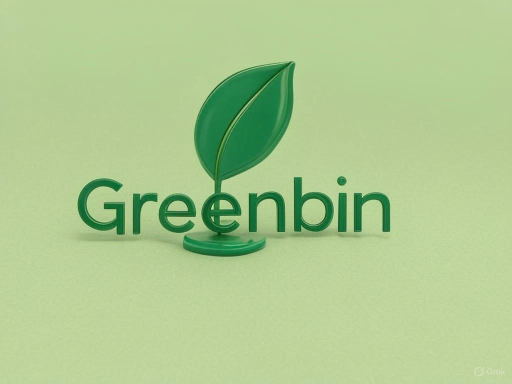
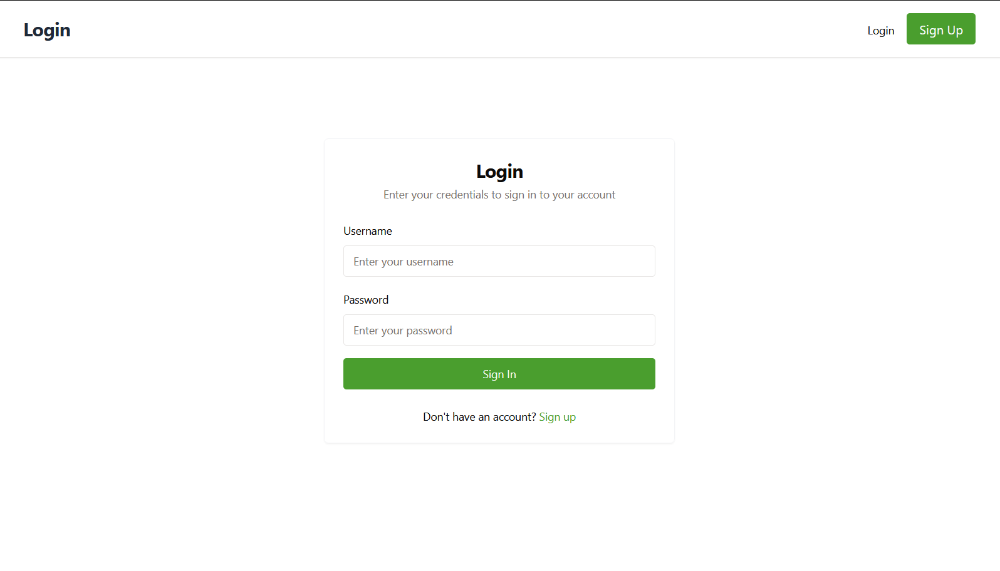
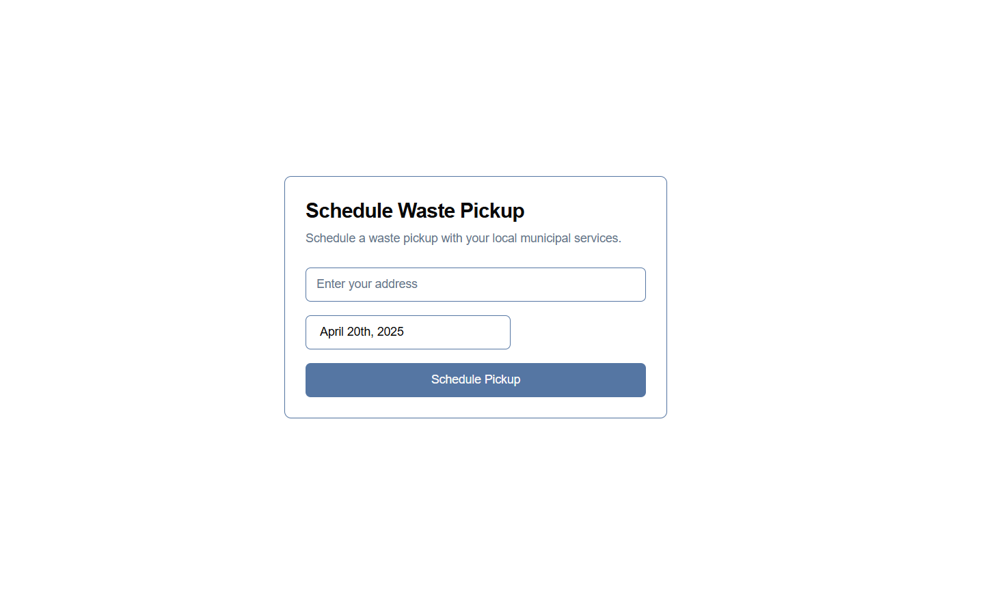
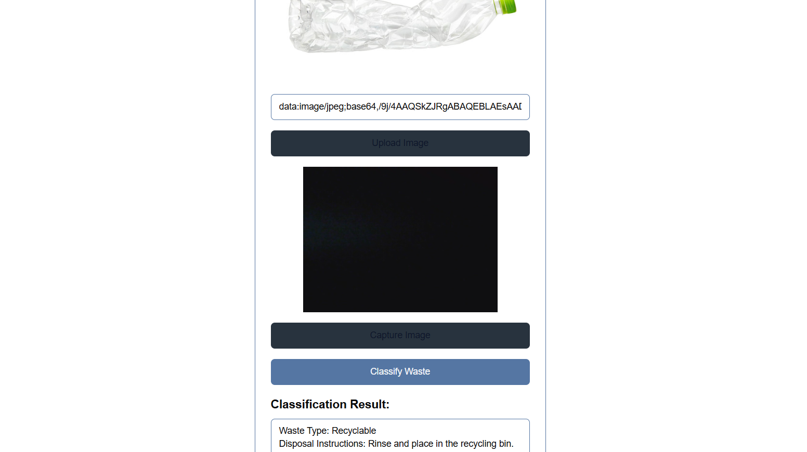
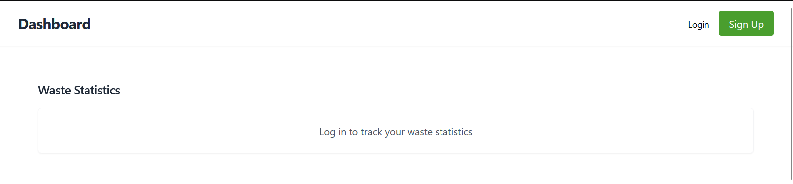
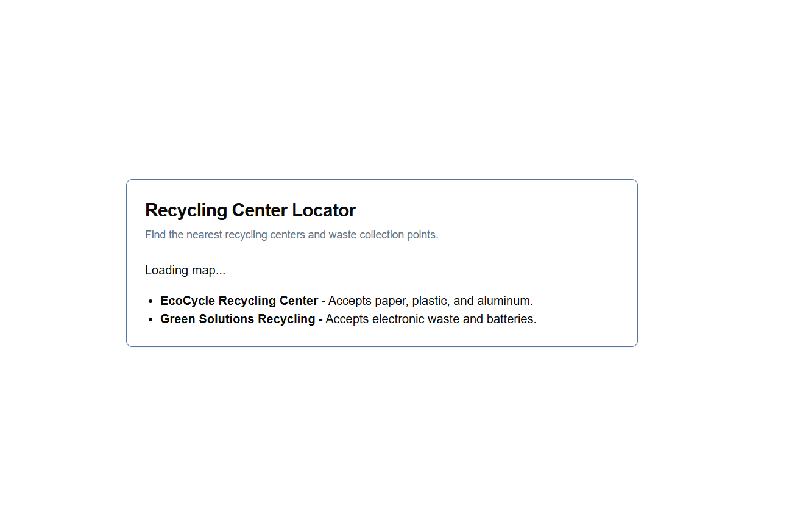
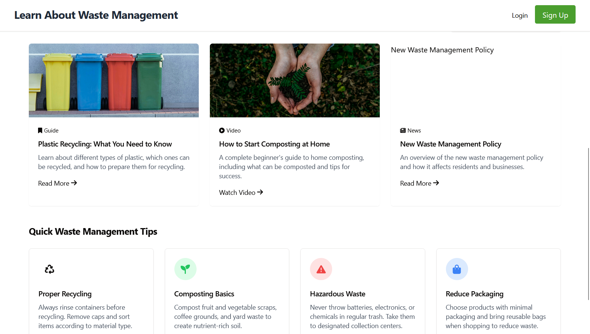

# Smart Waste Management System


*Empowering Sustainable Living with Smart Technology*

---

## Overview

Welcome to the **Smart Waste Management System**, a modern web application designed to revolutionize waste management for individuals and communities. Built during a hackathon using Firebase Studio, this project leverages React.js, Tailwind CSS, and Firebase services to provide an intuitive platform for waste classification, pickup scheduling, recycling center location, and community engagement. Inspired by a clean, green-accented design (akin to the "GreenBin" aesthetic), it promotes eco-friendly habits with features like waste classification using AI and a leaderboard for recycling challenges.

- **Purpose**: Encourage sustainable waste management through technology.
- **Target Users**: Individuals, communities, and environmental enthusiasts.
- **Tech Stack**: React.js, Tailwind CSS, Firebase (Authentication, Firestore, Hosting), TensorFlow.js (for waste classification), Google Maps API.

---

## Features

- **User Authentication**: Secure login and signup system powered by Firebase Authentication.
- **Waste Classification**: Upload images to classify waste types (e.g., recyclable, organic) using a TensorFlow.js model.
- **Schedule Waste Pickup**: Form to schedule pickups with address, date, and waste type selection, coordinated with local services.
- **Recycling Centers Locator**: Interactive Google Map to find nearby recycling centers with search and radius filters.
- **Community Leaderboard**: Track top recyclers and participate in challenges (e.g., Zero Waste Week) with Eco Points rewards.
- **Educational Resources**: Learn about waste management with guides, videos, and quick tips.
- **Dashboard**: View personal waste statistics and breakdowns by type.

---

## Screenshots

| **Login Page**              | **Schedule Waste Pickup**      | **Waste Classification**      |
|-----------------------------|--------------------------------|--------------------------------|
|  |  |  |

| **Dashboard**               | **Recycling Centers**          | **Learn Section**             |
|-----------------------------|--------------------------------|--------------------------------|
|  |  |  |

---

## Installation

### Prerequisites
- **Node.js** and **npm**: Install via [nvm](https://github.com/nvm-sh/nvm) (`nvm install --lts`).
- **Git**: Install with `sudo apt install git` (for WSL/Linux).
- **Firebase CLI**: Install globally with `npm install -g firebase-tools` and log in with `firebase login`.

### Clone the Repository
1. Clone the repo:
   ```bash
   git clone https://github.com/chndrakant-N/greenbin.git
